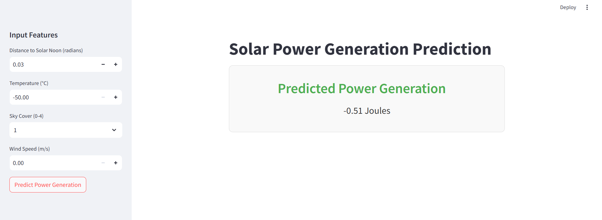

# Solar Power Prediction

## 📈 Objective
Predict solar power generation using environmental variables with high accuracy.

## 🚀 Model
Deployed an **XGBoost Regression Model** to predict power output based on features like temperature, wind speed, humidity, and more.

## 🎨 Deployment
Developed an interactive and stylish **Streamlit web app** for real-time predictions, offering an enhanced user experience.

## 📊 Dataset
Analyzed **2920 rows** of solar energy data for model training and evaluation.

## 📅 Milestone Timeline
From **EDA to deployment**, the project was completed in under 4 weeks.

## 🎥 Demo
Check out the app in action!  
  
*(Click the image above to view the screen recording.)*

## 🔗 Learnings and Skills
- **Data preprocessing**
- **Feature engineering**
- **Model building and evaluation**
- **Deployment using Streamlit**

